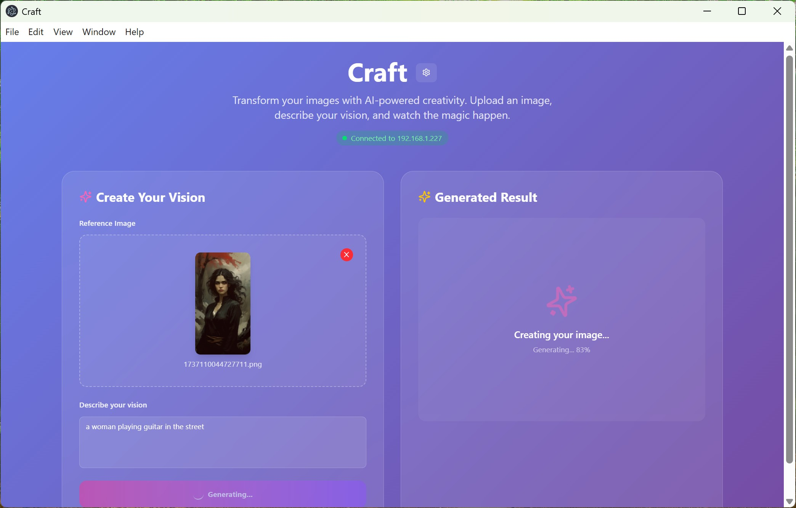
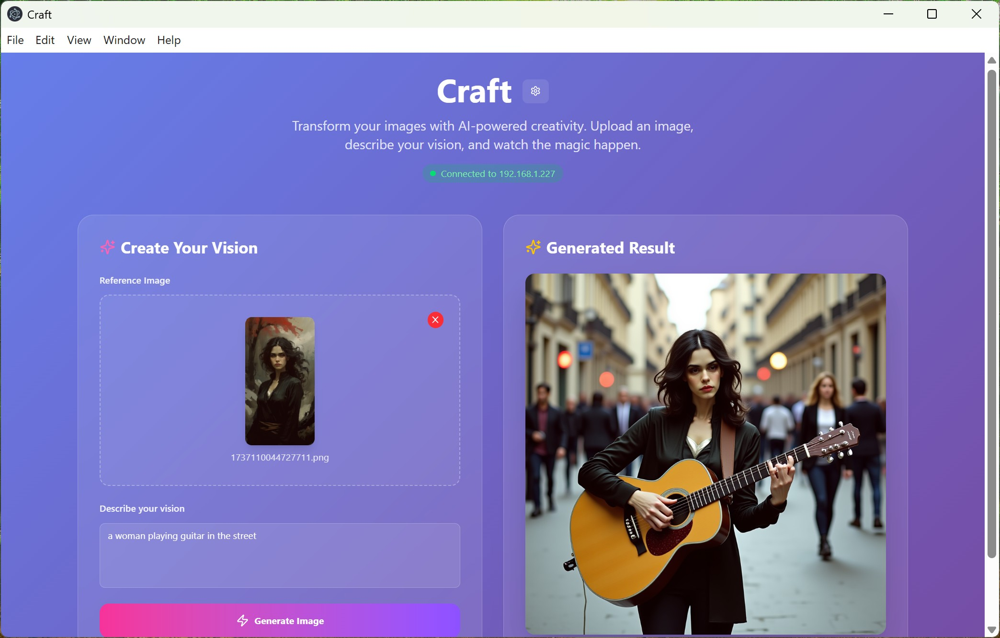

# Craft AI

A modern web application for AI-powered image generation using ComfyUI and DreamO. Transform your images with intelligent prompts and advanced AI models.





## Features

-   **AI Image Generation**: Create stunning images using state-of-the-art AI models.
-   **DreamO Integration**: Advanced image-to-image transformation capabilities.
-   **Real-time Progress**: Live WebSocket connection for generation progress tracking.
-   **Modern UI**: Beautiful glass-morphism design with dark theme.
-   **Flexible Configuration**: Support for local and remote ComfyUI instances.
-   **Cloudflare Access**: Built-in support for secure remote deployments.
-   **Image Upload**: Drag-and-drop image upload with preview.
-   **Download Results**: One-click download of generated images.

## Tech Stack

-   **Frontend**: React + TypeScript + Vite
-   **Styling**: Tailwind CSS with custom animations
-   **UI Components**: Radix UI + shadcn/ui
-   **HTTP Client**: Axios
-   **WebSocket**: Native WebSocket API
-   **Build Tool**: Vite
-   **Backend**: ComfyUI (separate installation required)

## Prerequisites

-   Node.js: Version 18 or higher
-   npm/yarn/pnpm: Package manager
-   ComfyUI: Local or remote ComfyUI server (see setup instructions below)

## Quick Start

1.  **Clone the Repository**
    ```bash
    git clone <repository-url>
    cd craft-ai
    ```
2.  **Install Dependencies**
    ```bash
    npm install
    # or
    yarn install
    # or
    pnpm install
    ```
3.  **Environment Configuration**
    Create a `.env` file in the root directory:
    ```env
    # ComfyUI Server Configuration
    VITE_COMFYUI_BASE_URL=http://localhost:8188
    VITE_COMFYUI_WS_URL=ws://localhost:8188

    # Optional: Cloudflare Access (for remote deployments)
    VITE_CF_ACCESS_CLIENT_ID=your-client-id
    VITE_CF_ACCESS_CLIENT_SECRET=your-client-secret
    ```
4.  **Start Development Server**
    ```bash
    npm run dev
    # or
    yarn dev
    # or
    pnpm dev
    ```
    The application will be available at `http://localhost:5173`.

## ComfyUI Setup

Craft AI requires a ComfyUI server with specific models and custom nodes. Follow these steps to set up ComfyUI locally:

### Prerequisites for ComfyUI

-   Python: 3.8 or higher
-   Git: For cloning repositories
-   CUDA: For GPU acceleration (recommended)
-   At least 12GB RAM: For model loading
-   GPU: NVIDIA GPU with 8GB+ VRAM (recommended)

### 1. Install ComfyUI

```bash
# Clone ComfyUI
git clone https://github.com/comfyanonymous/ComfyUI.git
cd ComfyUI

# Install dependencies
pip install -r requirements.txt

# Alternative: Use conda
# conda env create -f environment.yaml
# conda activate comfyui
```

### 2. Install DreamO Extension

DreamO is required for the advanced image transformation features:

```bash
# Navigate to custom nodes directory
cd custom_nodes

# Clone DreamO extension
git clone https://github.com/ToTheBeginning/ComfyUI-DreamO.git

# Install DreamO dependencies
cd ComfyUI-DreamO
pip install -r requirements.txt
```

### 3. Download Required Models

Create the following directory structure in your ComfyUI folder:

```
ComfyUI/
├── models/
│   ├── checkpoints/
│   ├── clip/
│   ├── loras/
│   ├── unet/
│   └── vae/
```

#### Core Models (Required)

Download these models and place them in the appropriate directories:

-   **FLUX Models**:
    -   `flux1-dev-Q8_0.gguf` → `models/unet/`
    -   `t5xxl_fp16.safetensors` → `models/clip/`
    -   `clip_l.safetensors` → `models/clip/`
    -   `ae.sft` → `models/vae/`

-   **DreamO LoRAs**:
    -   `dreamo_comfyui.safetensors` → `models/loras/`
    -   `dreamo_cfg_distill_comfyui.safetensors` → `models/loras/`
    -   `dreamo_quality_lora_pos_comfyui.safetensors` → `models/loras/`
    -   `dreamo_quality_lora_neg_comfyui.safetensors` → `models/loras/`
    -   `flux-turbo.safetensors` → `models/loras/`

#### Model Download Sources

-   **FLUX Models**: [Hugging Face - FLUX.1-dev](https://huggingface.co/core-gguf/FLUX.1-dev-GGUF/tree/main) (Example link, actual links might vary)
-   **DreamO Models**: [Hugging Face - DreamO](https://huggingface.co/aindao/DreamO/tree/main) (Example link, actual links might vary)
-   **LoRAs**: Check the DreamO repository for specific download links.

### 4. Start ComfyUI Server

```bash
# From the ComfyUI directory
python main.py

# For better performance with GPU
# python main.py --gpu-only

# For specific ports (if needed)
# python main.py --port 8188
```
ComfyUI will be available at `http://localhost:8188`.

### 5. Verify Installation

1.  Open ComfyUI in your browser: `http://localhost:8188`
2.  Check that all required nodes are available:
    -   `DreamOProcessorLoader`
    -   `ApplyDreamO`
    -   `DreamORefEncode`
    -   `FluxGuidance`
    -   `UnetLoaderGGUF`
3.  Try loading the models to ensure they're correctly placed.

## Configuration

### Application Settings

The application includes a settings panel accessible via the gear icon. You can configure:

-   **ComfyUI Base URL**: HTTP endpoint for your ComfyUI server.
-   **WebSocket URL**: WebSocket endpoint for real-time updates.
-   **Cloudflare Access**: Authentication for remote deployments.

### Preset Configurations

-   **Local Development**: `http://localhost:8188`
-   **Remote Server**: `https://your-domain.com`

### Environment Variables

| Variable                      | Description                        | Default                   |
| :---------------------------- | :--------------------------------- | :------------------------ |
| `VITE_COMFYUI_BASE_URL`       | ComfyUI HTTP endpoint              | `http://localhost:8188`   |
| `VITE_COMFYUI_WS_URL`         | ComfyUI WebSocket endpoint         | `ws://localhost:8188`     |
| `VITE_CF_ACCESS_CLIENT_ID`    | Cloudflare Access Client ID        | -                         |
| `VITE_CF_ACCESS_CLIENT_SECRET`| Cloudflare Access Client Secret    | -                         |

## Usage

### Basic Workflow

1.  **Upload an Image**: Drag and drop or click to select a reference image.
2.  **Enter a Prompt**: Describe the transformation you want.
3.  **Generate**: Click the "Generate Image" button.
4.  **Download**: Save your generated image.

### Example Prompts

-   `"a man playing guitar in the street, oil painting style"`
-   `"transform into a cyberpunk cityscape at night"`
-   `"anime style illustration with vibrant colors"`
-   `"photorealistic portrait with dramatic lighting"`

### Tips for Better Results

-   Use descriptive prompts with style keywords.
-   Reference images with clear subjects work best.
-   Experiment with different artistic styles.
-   Higher quality input images produce better results.

## Deployment

### Build for Production

```bash
npm run build
# or
yarn build
# or
pnpm build
```

### Deploy to Static Hosting

The built files in the `dist` directory can be deployed to:

-   Vercel
-   Netlify
-   GitHub Pages
-   Any static hosting service

### Remote ComfyUI Setup

For production deployments, you'll need:

-   A server running ComfyUI with all required models.
-   Proper firewall configuration for WebSocket connections.
-   HTTPS/WSS for secure connections.
-   Optional: Cloudflare Access for authentication.

## Troubleshooting

### Common Issues

#### Connection Failed
-   Verify ComfyUI is running on the correct port.
-   Check firewall settings.
-   Ensure WebSocket connections are allowed.

#### Missing Models
-   Check the ComfyUI console for missing model errors.
-   Verify all required models are downloaded and placed correctly.
-   Restart ComfyUI after adding new models.

#### Generation Errors
-   Check ComfyUI logs for detailed error messages.
-   Ensure all DreamO extensions are properly installed.
-   Verify model compatibility.

#### Upload Issues
-   Check file size limits (10MB default).
-   Ensure image format is supported (PNG, JPG).
-   Verify ComfyUI upload endpoint is accessible.

### Debug Mode

Use the browser's developer console to see detailed logs:

-   WebSocket connection status
-   API request/response details
-   Error messages and stack traces

## Contributing

1.  Fork the repository.
2.  Create a feature branch: `git checkout -b feature-name`
3.  Make your changes.
4.  Run tests: `npm test` (if applicable)
5.  Commit your changes: `git commit -m "Description"`
6.  Push to the branch: `git push origin feature-name`
7.  Submit a pull request.

## License

This project is licensed under the MIT License - see the `LICENSE` file for details.

## Acknowledgments

-   ComfyUI - The powerful node-based UI for Stable Diffusion
-   DreamO - Advanced image transformation capabilities
-   FLUX.1 - State-of-the-art diffusion model
-   shadcn/ui - Beautiful UI components

## Support

For issues and questions:

-   Check the ComfyUI Documentation
-   Review the DreamO Setup Guide
-   Open an issue in this repository

---

*Note: This application requires significant computational resources for local use. Consider using a GPU-enabled server for optimal performance.*
